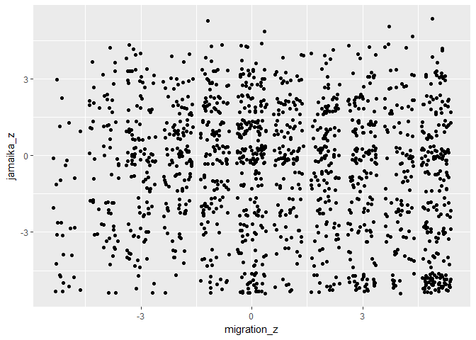
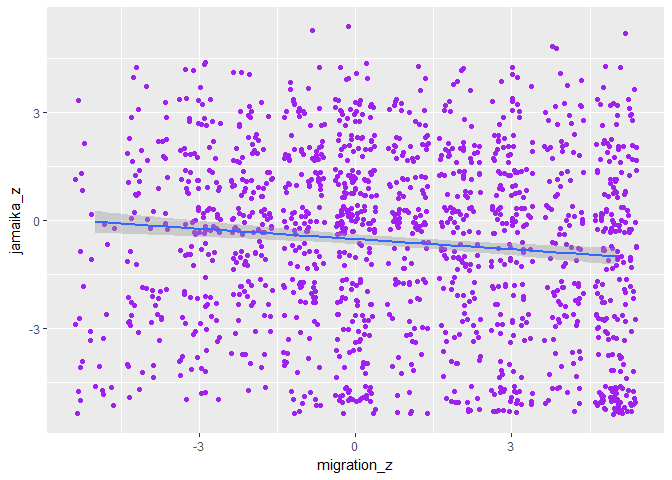
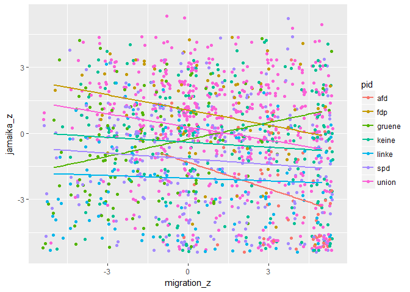
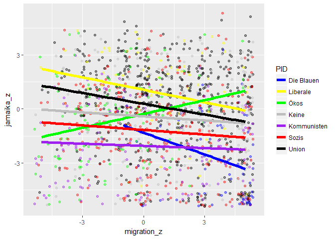
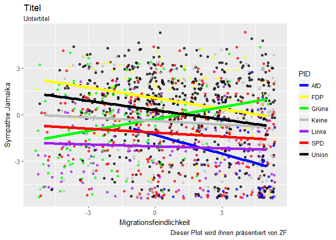
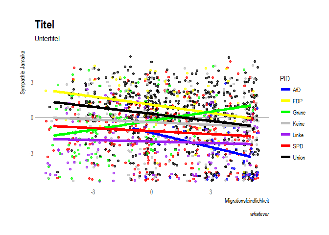
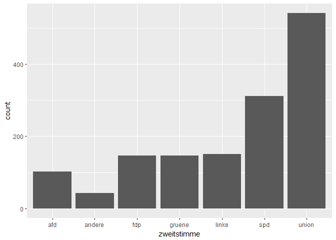
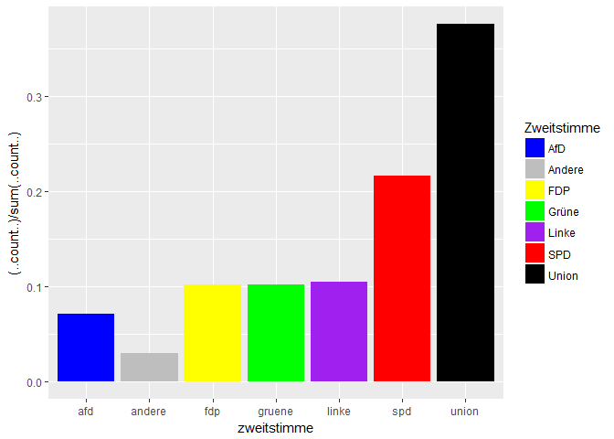
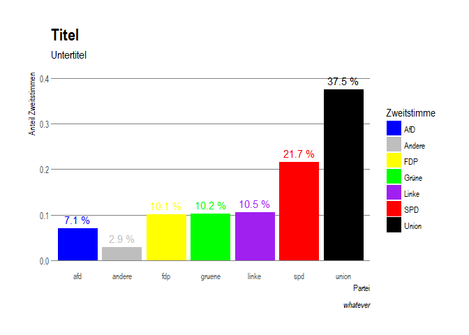
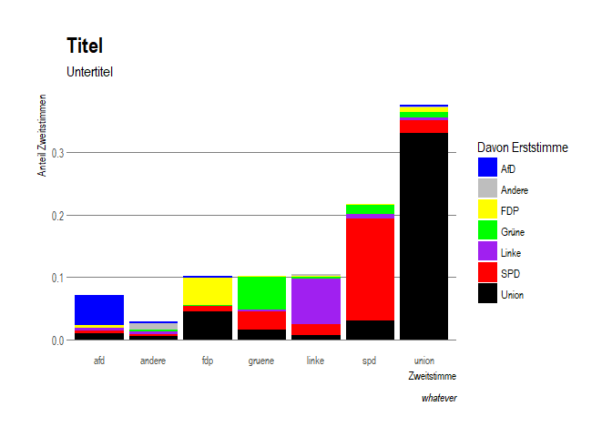

ggplot-tutorial
================
Marcel Schliebs
2 Dezember 2017

Welcome to this brief introduction to ggplot, which I taught in the framework of my tutorials in Applied Statistics and Quantitative Methods @Zeppelin University. If you have any questions, please shoot me an e-mail.

Load Packages
=============

At first, we need to load some packages. If you do not have them installed them yet, please do so once.

``` r
library(ggplot2)
library(hrbrthemes) 
library(extrafont)
```

Laden des Datensatzes:
======================

``` r
# This runs the script in the specified location, which again loads the dataset. 
# Attention: The datasets are NOT on github but must be included manually.
source("R/load_datasets/01a_loaddata_gles.R") 
```

Ein erster Überblick

``` r
str(gles_data)
```

    ## Classes 'tbl_df', 'tbl' and 'data.frame':    1441 obs. of  6 variables:
    ##  $ jamaika_z   : num  0 3 4 1 -5 -2 -1 1 4 -1 ...
    ##  $ zufr_groko_z: num  4 4 2 3 -5 1 3 3 3 1 ...
    ##  $ migration_z : num  0 3 3 2 5 5 -3 0 -3 0 ...
    ##  $ pid         : chr  "union" "union" "fdp" "union" ...
    ##  $ erststimme  : chr  "union" "union" "union" "union" ...
    ##  $ zweitstimme : chr  "union" "union" "fdp" "union" ...
    ##  - attr(*, "na.action")=Class 'omit'  Named int [1:740] 3 6 13 15 16 17 21 23 26 29 ...
    ##   .. ..- attr(*, "names")= chr [1:740] "3" "6" "13" "15" ...

``` r
head(gles_data)
```

    ## # A tibble: 6 x 6
    ##   jamaika_z zufr_groko_z migration_z   pid erststimme zweitstimme
    ##       <dbl>        <dbl>       <dbl> <chr>      <chr>       <chr>
    ## 1         0            4           0 union      union       union
    ## 2         3            4           3 union      union       union
    ## 3         4            2           3   fdp      union         fdp
    ## 4         1            3           2 union      union       union
    ## 5        -5           -5           5 union      union       union
    ## 6        -2            1           5 union      union       union

Einfache Scatterplots
=====================

Zusammenhang Sympathie Jamaika ~ Migrationseinstellung
------------------------------------------------------

``` r
ggplot(data = gles_data,            # GGplot starten und Datensatz angeben
       aes(x = migration_z,        # Specify mapping: aestethics (variable stuff)
           y = jamaika_z))  + 
  geom_jitter()                              # jittered scatterplot
```



Hinzufügen einer Regressionsgerade
----------------------------------

``` r
ggplot(data = gles_data,                          
       mapping = aes(x = migration_z,        
                     y = jamaika_z)) +  
  geom_jitter(color = "purple") + 
  geom_smooth(method = "lm") # lineare Regressionsgerade
```



Unterscheiden nach Parteiidentifikation (farblich)
--------------------------------------------------

``` r
ggplot(data = gles_data,                          
       mapping = aes(x = migration_z,        
                     y = jamaika_z,
                     col = pid)) +  # groupieren nach Color !
  geom_jitter() + 
  geom_smooth(method = "lm",se = FALSE) # wir schalten die Konfidenzintervalle aus 
```



Die Farben sind hässlich:
-------------------------

``` r
ggplot(data = gles_data,                          
       mapping = aes(x = migration_z,        
                     y = jamaika_z,
                     col = pid)) +  
  geom_jitter(alpha = 0.4) +  # wir machen die Punkte ein bisschen durchsichtig
  geom_smooth(size = 2,method = "lm",se = FALSE)+ 
  scale_color_manual(values = c("afd" = "blue",  # wir weisen den Parteien farben zu
                                "fdp" = "yellow",
                                "gruene" = "green",
                                "keine" = "grey",
                                "linke" = "purple",
                                "spd" = "red",
                                "union" = "black"),
                     name = "PID",
                     labels = c("Die Blauen","Liberale","Ökos","Keine","Kommunisten","Sozis","Union"))
```



Achsenlabels
------------

``` r
ggplot(data = gles_data,                          
       mapping = aes(x = migration_z,        
                     y = jamaika_z,
                     col = pid)) +  
  geom_jitter(alpha = 0.7) +  
  geom_smooth(size = 2,method = "lm",se = FALSE)+ 
  scale_color_manual(values = c("afd" = "blue",
                                "fdp" = "yellow",
                                "gruene" = "green",
                               "keine" = "grey",
                                "linke" = "purple",
                                "spd" = "red",
                                "union" = "black"),
                     name = "PID",
                     labels = c("AfD","FDP","Grüne","Keine","Linke","SPD","Union")) + 
  labs(x = "Migrationsfeindlichkeit", # Labels
       y = "Sympathie Jamaika",
       title = "Titel",
       subtitle = "Untertitel",
       caption = "Dieser Plot wird ihnen präsentiert von ZF")
```



Schönes Theme
-------------

Jetzt noch ein Theme und sichern unter dem Objekt gg1

``` r
gglala <-  # zuweisen
  ggplot(data = gles_data,                          
       mapping = aes(x = migration_z,        
                     y = jamaika_z,
                     col = pid)) +  
  geom_jitter(alpha = 0.7) +  
  geom_smooth(size = 2,method = "lm",se = FALSE)+ 
  scale_color_manual(values = c("afd" = "blue",
                                "fdp" = "yellow",
                                "gruene" = "green",
                                "keine" = "grey",
                                "linke" = "purple",
                                "spd" = "red",
                                "union" = "black"),
                     name = "PID",
                     labels = c("AfD","FDP","Grüne","Keine","Linke","SPD","Union")) + 
  labs(x = "Migrationsfeindlichkeit", 
       y = "Sympathie Jamaika",
       title = "Titel",
       subtitle = "Untertitel",
       caption = "whatever") + 
 theme_ipsum(grid = "Y") #Theme mit schöner Schrit und mit horizontalen Grid-Linien

gglala #print
```



Output zum Einbinden ins Paper
------------------------------

### Entweder pdf

``` r
ggsave(filename = "results/gles_jitterplot.pdf",
       plot = gglala,
       device = "pdf",
       width = 10,
       height = 6,
       dpi = 2000)
```

### oder png

``` r
ggsave(filename = "results/gles_jitterplot.png",
       plot = gg1,
       device = "png",
       width = 10,
       height = 6,
       dpi = 2000)
```

####################################################################### 

Barplots Wahlentscheidung
=========================

Eindimensional
--------------

``` r
table(gles_data$zweitstimme)
```

    ## 
    ##    afd andere    fdp gruene  linke    spd  union 
    ##    102     42    146    147    151    312    541

Häufigkeitsverteilung der Zweitstimme
-------------------------------------

``` r
ggplot(data = gles_data) + 
  geom_bar(aes(x = zweitstimme))
```



In Prozent
----------

``` r
ggplot(data = gles_data) + 
  geom_bar(aes(x = zweitstimme,
               y = (..count..)/sum(..count..), # relative häufigkeit 
               fill = zweitstimme))+ # Farblich
  scale_fill_manual(values = c("afd" = "blue",
                                "fdp" = "yellow",
                                "gruene" = "green",
                                "andere" = "grey",
                                "linke" = "purple",
                                "spd" = "red",
                                "union" = "black"),
                     name = "Zweitstimme",
                     labels = c("AfD","Andere","FDP","Grüne","Linke","SPD","Union"))
```



Labels + Theme/Labels
---------------------

``` r
ggplot(data = gles_data,
       aes(x = zweitstimme,
           y = (..count..)/sum(..count..), # relative häufigkeit 
           fill = zweitstimme)) + 
  geom_bar(stat = "count")+ # Farblich 
  
  geom_text(aes(x = zweitstimme,
                y=..count../sum(..count..)+0.02,
                label=paste0(round(..count../sum(..count..)*100,1)," %"),
                color = zweitstimme), 
            stat="count")+
  scale_fill_manual(values = c("afd" = "blue",
                               "fdp" = "yellow",
                               "gruene" = "green",
                               "andere" = "grey",
                               "linke" = "purple",
                               "spd" = "red",
                               "union" = "black"),
                    name = "Zweitstimme",
                    labels = c("AfD","Andere","FDP","Grüne","Linke","SPD","Union"))+
  scale_color_manual(values = c("afd" = "blue",
                                "fdp" = "yellow",
                                "gruene" = "green",
                                "andere" = "grey",
                                "linke" = "purple",
                                "spd" = "red",
                                "union" = "black"),
                     name = "Zweitstimme",
                     labels = c("AfD","Andere","FDP","Grüne","Linke","SPD","Union"))+
  labs(x = "Partei", 
       y = "Anteil Zweitstimmen",
       title = "Titel",
       subtitle = "Untertitel",
       caption = "whatever") + 
  theme_ipsum(grid = "Y") #Theme mit schöner Schrit und mit horizontalen Grid-Linien
```



Twodimensional Barplots
-----------------------

``` r
# Descriptive overview
round(
  prop.table(
  table(zweit = gles_data$zweitstimme,
        erst = gles_data$erststimme),margin = 1),2)
```

    ##         erst
    ## zweit     afd andere  fdp gruene linke  spd union
    ##   afd    0.69   0.00 0.05   0.00  0.06 0.07  0.14
    ##   andere 0.14   0.31 0.00   0.12  0.17 0.07  0.19
    ##   fdp    0.02   0.00 0.43   0.03  0.00 0.08  0.45
    ##   gruene 0.01   0.00 0.01   0.52  0.03 0.28  0.16
    ##   linke  0.00   0.03 0.01   0.04  0.69 0.17  0.07
    ##   spd    0.00   0.00 0.01   0.07  0.03 0.76  0.14
    ##   union  0.01   0.00 0.02   0.02  0.01 0.06  0.88

``` r
# In plot
gg1 <- #objekt zuweisen
  ggplot(data = gles_data,
         aes(x = zweitstimme,
             y = (..count..)/sum(..count..), 
             fill = erststimme)) + 
  geom_bar(stat = "count")+ 
  scale_fill_manual(values = c("afd" = "blue",
                               "fdp" = "yellow",
                               "gruene" = "green",
                               "andere" = "grey",
                               "linke" = "purple",
                               "spd" = "red",
                               "union" = "black"),
                    name = "Davon Erststimme",
                    labels = c("AfD","Andere","FDP","Grüne","Linke","SPD","Union"))+
  scale_color_manual(values = c("afd" = "blue",
                                "fdp" = "yellow",
                                "gruene" = "green",
                                "andere" = "grey",
                                "linke" = "purple",
                                "spd" = "red",
                                "union" = "black"),
                     name = "Davon Erststimme",
                     labels = c("AfD","Andere","FDP","Grüne","Linke","SPD","Union"))+
  labs(x = "Zweitstimme", 
       y = "Anteil Zweitstimmen",
       title = "Titel",
       subtitle = "Untertitel",
       caption = "whatever") + 
  theme_ipsum(grid = "Y")
gg1 #print
```



Output to pdf
-------------

``` r
ggsave(filename = "results/gles_barplot__stacked.pdf",
       plot = gg1,
       device = "pdf",
       width = 10,
       height = 6,
       dpi = 1000)
```
