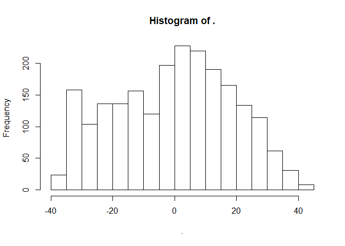
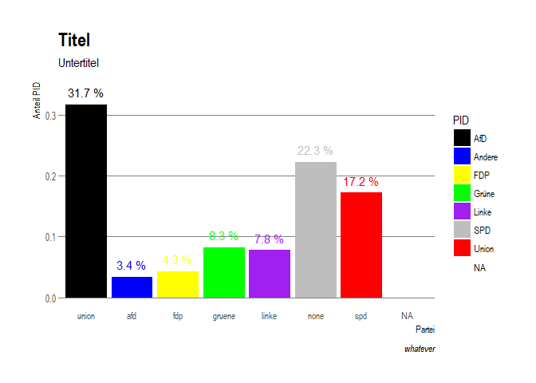
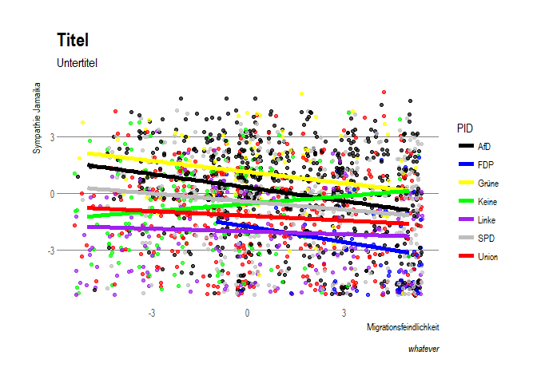

tl:dr-Skript: Summary over the most important bits
================
Marcel Schliebs
2 Dezember 2017

This document shall recapitulate the most important bits we covered during the tutorial in Applied Statistics with R @Zeppelin University in Fall 17. If you have any questions, please shoot me an e-mail. Ich schreib das jetzt auf Englisch, da ich in Kontakt mit ein paar R-Teachern in Australien bin und ein wenig didaktische Methoden mit denen sharen will. Please forgive me.

Indexing and Data Structure
===========================

We create a vector with electoral results

``` r
x <- c(33,20.8,9,10,9,13)
```

And attribute party names to it

``` r
names(x) <- c("CDU","SPD","GRUENE","FDP","LINKE","AFD")
```

Indexing by name

``` r
x["AFD"]
```

    ## AFD 
    ##  13

Indexing by position

``` r
x[2]
```

    ##  SPD 
    ## 20.8

``` r
x[1] - x[2]
```

    ##  CDU 
    ## 12.2

Select several elements

``` r
jamaika <- x[c(1,3,4)]
sum(jamaika)
```

    ## [1] 52

Indexing through logical vector

``` r
sel <- c(TRUE,TRUE,FALSE,FALSE,FALSE,FALSE)
x[sel]
```

    ##  CDU  SPD 
    ## 33.0 20.8

Calculate logical vector

``` r
sel <- x > 20
```

And use for selection

``` r
x[sel]
```

    ##  CDU  SPD 
    ## 33.0 20.8

Overwrite elements

``` r
x[1] <- x[1]-10
x[2] <- x[2]+10
x
```

    ##    CDU    SPD GRUENE    FDP  LINKE    AFD 
    ##   23.0   30.8    9.0   10.0    9.0   13.0

FPD ? Not available any more...

``` r
x[4] <- NA
x
```

    ##    CDU    SPD GRUENE    FDP  LINKE    AFD 
    ##   23.0   30.8    9.0     NA    9.0   13.0

Loading Packages
================

Packages are collections of useful functions that fellow nerds wrote and put them online. One of the greatest benefits of R is its extremely rich framework of packages for every kind of use that you can imagine.

At first, we need to load some packages. If you do not have them installed them yet, please do so **once**. You can install a package by running the command `install.packages("NAME")` in R.

The most important packages we got to know during the semester were:

Data management

-   `plyr`: Plyr is the older (and outdated) brother of tidyverse. We always need to load it once BEFORE (!) the latter in order to avoid nasty conflicts.
-   `tidyverse`: A very useful collection of tools for data-management.
-   `magrittr`: Gives us the beautiful Doppelpipe `%<>%`

Data Loading

-   `haven` enables us to nicely import .sav or .dta Datasets.

Data Viz

-   `ggplot2` is the most beautiful shit ever
-   `ggthemes` and `hrbrthemes` make it even more brilliant
-   `extrafont` fixes a problem with fonts for outputting plots to pdf
-   `stargazer` gives us nice regression output tables

We load the most important packages

``` r
library(plyr)
library(tidyverse)
library(magrittr)

library(haven)

library(ggplot2)
library(ggthemes)
library(hrbrthemes)
library(extrafont)

library(stargazer)
```

Loading of the Dataset:
=======================

Wir load the newest edition of the 2017-Bundestagswahl GLES study

``` r
gles <- read_spss(file = "data/offline/gles/ZA6800_v1-0-0.sav",
                  user_na = T)
```

With this most recent dataset, we need to apply a little trick to fix a problem with labels.

``` r
gles[] <- lapply(gles, unclass)
```

A first overview

``` r
# str(gles)
# head(gles)
```

Data Recoding
=============

We can now go on to recode the data. We therefore use to double-pipe `%<>%` in order to not have to type `gles$` every single time.

``` r
gles%<>%within({
  
  #Jamaika: AV
  jamaika <- q73f
  jamaika[q73f %in% c(-99, -98)] <- NA
  jamaika_z <- jamaika - 6 # center on the middle of the scale
  
  #GroKo: UV1
  
  zufr_groko <- q67 
  zufr_groko[q67 %in% c(-99,-98)]<- NA
  zufr_groko_z <- zufr_groko -6 # center on the middle of the scale
  
  #Migration: UV2
  
  migration <- q60
  migration [q60 %in% c(-99,-98)] <- NA
  migration_z <- migration -6  # center on the middle of the scale
  

  #Partei ID: #Codiere nur spefifizierte Parteien
  pid <- NA
  pid[q99a %in% c(1,2,3)]<- "union"
  pid[q99a %in% c(4)]<-     "spd"
  pid[q99a %in% c(6)]<-    "gruene"
  pid[q99a %in% c(7)]<-    "linke"
  pid[q99a %in% c(5)]<-    "fdp"
  pid[q99a %in% c(322)]<-  "afd"
  pid[q99a %in% c(808)]<- "none"
  
  # Make Union the reference category
  pid <- factor(pid)
  pid <- relevel (pid,ref = "union") #make union the reference category
  
  #Sex
  gender <- factor(x = q1,levels = 1:2,labels = c("male","female"))

  #Age
  
  alter <- 2017-q2a #gebursjahr
  alter [q2a %in% c(-97,-98,-99)] <- NA
  alter_z <- alter-mean(alter,na.rm = TRUE) # center on the mean
  
  #Ost/West: Recode after Geburtstland bula
  '
    (1) Baden-Württemberg
    (2) Bayern
    (3) Berlin
    (4) Brandenburg
    (5) Bremen
    (6) Hamburg
    (7) Hessen
    (8) Mecklenburg-Vorpommern
    (9) Niedersachsen
    (10) Nordrhein-Westfalen
    (11) Rheinland-Pfalz
    (12) Saarland
    (13) Sachsen
    (14) Sachsen-Anhalt
    (15) Schleswig-Holstein
    (16) Thüringen
  '
  ost <- NA
  ost[bula %in% c(1,2,5,6,7,9,10,11,12,15)] <- 0
  ost[bula %in% c(3,4,8,13,14,16)] <- 1
  ost[bula %in% c(-97,-98,-99)] <- NA

})
```

Descriptive Statistics
======================

Dependent Variable: Jamaika
---------------------------

``` r
# Jamaika
gles$jamaika_z %>% table %>% prop.table %>% round(2)
```

    ## .
    ##   -5   -4   -3   -2   -1    0    1    2    3    4    5 
    ## 0.12 0.06 0.09 0.10 0.10 0.20 0.13 0.11 0.07 0.03 0.00

``` r
# Migrationseinstellung
gles$migration_z %>% table %>% prop.table %>% round(2)  
```

    ## .
    ##   -5   -4   -3   -2   -1    0    1    2    3    4    5 
    ## 0.02 0.04 0.07 0.09 0.10 0.16 0.09 0.09 0.11 0.07 0.16

``` r
# Zufriedenheit Groko
gles$zufr_groko_z %>% table %>% prop.table %>% round(2) 
```

    ## .
    ##   -5   -4   -3   -2   -1    0    1    2    3    4    5 
    ## 0.04 0.03 0.06 0.05 0.05 0.12 0.11 0.21 0.24 0.09 0.02

``` r
#Alter
gles$alter_z %>% hist()                   
```



``` r
#Gender
gles$gender %>% table %>% prop.table %>% round(2)   
```

    ## .
    ##   male female 
    ##    0.5    0.5

``` r
#Ost/West
gles$ost %>% table %>% prop.table %>% round(2)                           
```

    ## .
    ##    0    1 
    ## 0.63 0.37

Independent/Control Variable: Party Identification
--------------------------------------------------

For a more detailed introduction to `ggplot2`, please click \[here\] (<https://github.com/schliebs/ZU_teaching_applied_statistics/blob/master/R/datavisualization_ggplot/01b_ggplot_gles_TUTORIAL.md>)

``` r
gles$pid %>% table %>% prop.table %>% round(2)                           
```

    ## .
    ##  union    afd    fdp gruene  linke   none    spd 
    ##   0.33   0.04   0.05   0.09   0.08   0.23   0.18

``` r
# Have a graphical look at it:
ggplot(data = gles,
       aes(x = pid,
           y = (..count..)/sum(..count..), # relative häufigkeit 
           fill = pid)) + 
  geom_bar(stat = "count")+ # Farblich 
  
  geom_text(aes(x = pid,
                y=..count../sum(..count..)+0.02,
                label=paste0(round(..count../sum(..count..)*100,1)," %"),
                color = pid), 
            stat="count")+
  scale_fill_manual(values = c("afd" = "blue",
                               "fdp" = "yellow",
                               "gruene" = "green",
                               "none" = "grey",
                               "linke" = "purple",
                               "spd" = "red",
                               "union" = "black"),
                    name = "PID",
                    labels = c("AfD","Andere","FDP","Grüne","Linke","SPD","Union"))+
  scale_color_manual(values = c("afd" = "blue",
                                "fdp" = "yellow",
                                "gruene" = "green",
                                "none" = "grey",
                                "linke" = "purple",
                                "spd" = "red",
                                "union" = "black"),
                     name = "PID",
                     labels = c("AfD","Andere","FDP","Grüne","Linke","SPD","Union"))+
  labs(x = "Partei", 
       y = "Anteil PID",
       title = "Titel",
       subtitle = "Untertitel",
       caption = "whatever") + 
  theme_ipsum(grid = "Y") 
```



Model building
==============

For our analysis, we now build a sub model data frame with only our relevant variables included.

``` r
gles_data <- gles %>% select(jamaika_z,pid,migration_z,zufr_groko_z,alter_z,gender,ost)
```

We have a look at the first 10 observations:

``` r
head(gles_data,n = 10)
```

    ## # A tibble: 10 x 7
    ##    jamaika_z    pid migration_z zufr_groko_z    alter_z gender   ost
    ##        <dbl> <fctr>       <dbl>        <dbl>      <dbl> <fctr> <dbl>
    ##  1         0  union           0            4  23.778542 female     0
    ##  2         3  union           3            4  29.778542   male     0
    ##  3         0    spd          -4            0 -35.221458   male     0
    ##  4         4    fdp           3            2  10.778542 female     0
    ##  5         1  union           2            3 -13.221458   male     0
    ##  6         4    fdp          -5            1 -34.221458 female     0
    ##  7        -5  union           5           -5  21.778542 female     0
    ##  8        -2  union           5            1   1.778542 female     0
    ##  9        -1   none          -3            3   7.778542 female     0
    ## 10         1 gruene           0            3 -31.221458 female     0

We see that some have NA still. We thus throw out all rows that include at least one NA.

``` r
gles_data %<>% na.omit()
```

Relationship between Sympathy Jamaika and Issue position migration
------------------------------------------------------------------

We estimate our first linear base model

``` r
mod1 <- lm(jamaika_z ~ migration_z, data = gles_data)
summary(mod1)
```

    ## 
    ## Call:
    ## lm(formula = jamaika_z ~ migration_z, data = gles_data)
    ## 
    ## Residuals:
    ##     Min      1Q  Median      3Q     Max 
    ## -5.0516 -1.9310  0.4305  1.7921  6.1536 
    ## 
    ## Coefficients:
    ##             Estimate Std. Error t value Pr(>|t|)    
    ## (Intercept) -0.55103    0.05956  -9.251  < 2e-16 ***
    ## migration_z -0.12052    0.02024  -5.953 3.12e-09 ***
    ## ---
    ## Signif. codes:  0 '***' 0.001 '**' 0.01 '*' 0.05 '.' 0.1 ' ' 1
    ## 
    ## Residual standard error: 2.501 on 1933 degrees of freedom
    ## Multiple R-squared:  0.018,  Adjusted R-squared:  0.0175 
    ## F-statistic: 35.44 on 1 and 1933 DF,  p-value: 3.115e-09

We further suspect that there is an interaction between **pid** and the **migration position**

``` r
mod2 <- lm(jamaika_z ~ migration_z * pid, data = gles_data)
summary(mod2)
```

    ## 
    ## Call:
    ## lm(formula = jamaika_z ~ migration_z * pid, data = gles_data)
    ## 
    ## Residuals:
    ##     Min      1Q  Median      3Q     Max 
    ## -6.5034 -1.7859  0.2141  1.7064  6.5228 
    ## 
    ## Coefficients:
    ##                       Estimate Std. Error t value Pr(>|t|)    
    ## (Intercept)            0.30747    0.10286   2.989  0.00283 ** 
    ## migration_z           -0.23919    0.03649  -6.555 7.11e-11 ***
    ## pidafd                -2.06542    0.69844  -2.957  0.00314 ** 
    ## pidfdp                 0.82650    0.27008   3.060  0.00224 ** 
    ## pidgruene             -0.85204    0.23221  -3.669  0.00025 ***
    ## pidlinke              -2.32194    0.20964 -11.076  < 2e-16 ***
    ## pidnone               -0.74070    0.16575  -4.469 8.33e-06 ***
    ## pidspd                -1.49510    0.16299  -9.173  < 2e-16 ***
    ## migration_z:pidafd    -0.03685    0.17570  -0.210  0.83388    
    ## migration_z:pidfdp     0.04097    0.10863   0.377  0.70612    
    ## migration_z:pidgruene  0.37488    0.08662   4.328 1.58e-05 ***
    ## migration_z:pidlinke   0.18929    0.06775   2.794  0.00526 ** 
    ## migration_z:pidnone    0.09564    0.05477   1.746  0.08094 .  
    ## migration_z:pidspd     0.15541    0.05886   2.640  0.00835 ** 
    ## ---
    ## Signif. codes:  0 '***' 0.001 '**' 0.01 '*' 0.05 '.' 0.1 ' ' 1
    ## 
    ## Residual standard error: 2.353 on 1921 degrees of freedom
    ## Multiple R-squared:  0.136,  Adjusted R-squared:  0.1302 
    ## F-statistic: 23.26 on 13 and 1921 DF,  p-value: < 2.2e-16

Finally, we include the **government satisfaction**, **age**, **gender** and **East/West** as control variables.

``` r
mod3 <- lm(jamaika_z ~ migration_z * pid + zufr_groko_z + alter_z + gender, data = gles_data)
summary(mod3)
```

    ## 
    ## Call:
    ## lm(formula = jamaika_z ~ migration_z * pid + zufr_groko_z + alter_z + 
    ##     gender, data = gles_data)
    ## 
    ## Residuals:
    ##     Min      1Q  Median      3Q     Max 
    ## -6.3511 -1.6151  0.2177  1.6607  8.2483 
    ## 
    ## Coefficients:
    ##                        Estimate Std. Error t value Pr(>|t|)    
    ## (Intercept)           -0.290759   0.126153  -2.305 0.021284 *  
    ## migration_z           -0.178490   0.035993  -4.959 7.71e-07 ***
    ## pidafd                -1.529404   0.682057  -2.242 0.025053 *  
    ## pidfdp                 1.008811   0.263833   3.824 0.000136 ***
    ## pidgruene             -0.664030   0.229099  -2.898 0.003793 ** 
    ## pidlinke              -1.579280   0.215796  -7.318 3.67e-13 ***
    ## pidnone               -0.372314   0.167406  -2.224 0.026263 *  
    ## pidspd                -1.205932   0.160418  -7.517 8.53e-14 ***
    ## zufr_groko_z           0.260500   0.024610  10.585  < 2e-16 ***
    ## alter_z               -0.011535   0.002941  -3.922 9.10e-05 ***
    ## genderfemale          -0.016456   0.105113  -0.157 0.875611    
    ## migration_z:pidafd     0.085043   0.171001   0.497 0.619018    
    ## migration_z:pidfdp     0.032748   0.105506   0.310 0.756297    
    ## migration_z:pidgruene  0.311099   0.084319   3.690 0.000231 ***
    ## migration_z:pidlinke   0.197392   0.065894   2.996 0.002774 ** 
    ## migration_z:pidnone    0.112624   0.053191   2.117 0.034358 *  
    ## migration_z:pidspd     0.140538   0.057169   2.458 0.014047 *  
    ## ---
    ## Signif. codes:  0 '***' 0.001 '**' 0.01 '*' 0.05 '.' 0.1 ' ' 1
    ## 
    ## Residual standard error: 2.284 on 1918 degrees of freedom
    ## Multiple R-squared:  0.1872, Adjusted R-squared:  0.1804 
    ## F-statistic:  27.6 on 16 and 1918 DF,  p-value: < 2.2e-16

Try to interpret the results!

Regression Output:
==================

We make use of the nice stargazer-package. The file to embed in your word will be written in your results/tables folder.

``` r
stargazer(mod1,mod2,mod3,  #regression models 
          type = "html", # character vector (eg. "text" / "html" / "latex")
          title = "Hier steht die Überschrift",  # header
          style = "default",  # style (choice see below)
          summary = NULL,  # logical vector: output summary statistics when given data.frame,
          out = "results/tables/all_models.html", # path and output of file
          out.header = FALSE, # logical vector: should output file contain code-header?
          column.labels = c("Base Model","Including Interaction","Full model"), # column labels for mod1/mod2
          column.separate = c(1,1),  # how column labels should be assigned (label over sev. columns possible)
          covariate.labels = c("Migration",  # Covariate Labels
                               "PID AfD (Reference CDU)",
                               "PID FDP",
                               "PID Grüne",
                               "PID Linke",
                               "PID None",
                               "PID SPD",
                               "Zufriedenheit Groko",
                               "Age",
                               "Gender female (ref. male)",
                               "Interaktion Migration : PID AfD",
                               "Interaktion Migration : PID FDP",
                               "Interaktion Migration : PID Grüne",
                               "Interaktion Migration : PID Linke",
                               "Interaktion Migration : PID None",
                               "Interaktion Migration : PID SPD", 
                               "Intercept"),
          dep.var.caption = "Dep. Var", # Caption (Top) of dependent variable
          star.cutoffs = c(0.05,0.01,0.001),
          dep.var.labels = c("Sympathie Jamaika")
)
```

<table style="text-align:center">
<caption>
<strong>Hier steht die Überschrift</strong>
</caption>
<tr>
<td colspan="4" style="border-bottom: 1px solid black">
</td>
</tr>
<tr>
<td style="text-align:left">
</td>
<td colspan="3">
Dep. Var
</td>
</tr>
<tr>
<td>
</td>
<td colspan="3" style="border-bottom: 1px solid black">
</td>
</tr>
<tr>
<td style="text-align:left">
</td>
<td colspan="3">
Sympathie Jamaika
</td>
</tr>
<tr>
<td style="text-align:left">
</td>
<td>
Base Model
</td>
<td>
Including Interaction
</td>
<td>
Full model
</td>
</tr>
<tr>
<td style="text-align:left">
</td>
<td>
(1)
</td>
<td>
(2)
</td>
<td>
(3)
</td>
</tr>
<tr>
<td colspan="4" style="border-bottom: 1px solid black">
</td>
</tr>
<tr>
<td style="text-align:left">
Migration
</td>
<td>
-0.121<sup>\*\*\*</sup>
</td>
<td>
-0.239<sup>\*\*\*</sup>
</td>
<td>
-0.178<sup>\*\*\*</sup>
</td>
</tr>
<tr>
<td style="text-align:left">
</td>
<td>
(0.020)
</td>
<td>
(0.036)
</td>
<td>
(0.036)
</td>
</tr>
<tr>
<td style="text-align:left">
</td>
<td>
</td>
<td>
</td>
<td>
</td>
</tr>
<tr>
<td style="text-align:left">
PID AfD (Reference CDU)
</td>
<td>
</td>
<td>
-2.065<sup>\*\*</sup>
</td>
<td>
-1.529<sup>\*</sup>
</td>
</tr>
<tr>
<td style="text-align:left">
</td>
<td>
</td>
<td>
(0.698)
</td>
<td>
(0.682)
</td>
</tr>
<tr>
<td style="text-align:left">
</td>
<td>
</td>
<td>
</td>
<td>
</td>
</tr>
<tr>
<td style="text-align:left">
PID FDP
</td>
<td>
</td>
<td>
0.826<sup>\*\*</sup>
</td>
<td>
1.009<sup>\*\*\*</sup>
</td>
</tr>
<tr>
<td style="text-align:left">
</td>
<td>
</td>
<td>
(0.270)
</td>
<td>
(0.264)
</td>
</tr>
<tr>
<td style="text-align:left">
</td>
<td>
</td>
<td>
</td>
<td>
</td>
</tr>
<tr>
<td style="text-align:left">
PID Grüne
</td>
<td>
</td>
<td>
-0.852<sup>\*\*\*</sup>
</td>
<td>
-0.664<sup>\*\*</sup>
</td>
</tr>
<tr>
<td style="text-align:left">
</td>
<td>
</td>
<td>
(0.232)
</td>
<td>
(0.229)
</td>
</tr>
<tr>
<td style="text-align:left">
</td>
<td>
</td>
<td>
</td>
<td>
</td>
</tr>
<tr>
<td style="text-align:left">
PID Linke
</td>
<td>
</td>
<td>
-2.322<sup>\*\*\*</sup>
</td>
<td>
-1.579<sup>\*\*\*</sup>
</td>
</tr>
<tr>
<td style="text-align:left">
</td>
<td>
</td>
<td>
(0.210)
</td>
<td>
(0.216)
</td>
</tr>
<tr>
<td style="text-align:left">
</td>
<td>
</td>
<td>
</td>
<td>
</td>
</tr>
<tr>
<td style="text-align:left">
PID None
</td>
<td>
</td>
<td>
-0.741<sup>\*\*\*</sup>
</td>
<td>
-0.372<sup>\*</sup>
</td>
</tr>
<tr>
<td style="text-align:left">
</td>
<td>
</td>
<td>
(0.166)
</td>
<td>
(0.167)
</td>
</tr>
<tr>
<td style="text-align:left">
</td>
<td>
</td>
<td>
</td>
<td>
</td>
</tr>
<tr>
<td style="text-align:left">
PID SPD
</td>
<td>
</td>
<td>
-1.495<sup>\*\*\*</sup>
</td>
<td>
-1.206<sup>\*\*\*</sup>
</td>
</tr>
<tr>
<td style="text-align:left">
</td>
<td>
</td>
<td>
(0.163)
</td>
<td>
(0.160)
</td>
</tr>
<tr>
<td style="text-align:left">
</td>
<td>
</td>
<td>
</td>
<td>
</td>
</tr>
<tr>
<td style="text-align:left">
Zufriedenheit Groko
</td>
<td>
</td>
<td>
</td>
<td>
0.260<sup>\*\*\*</sup>
</td>
</tr>
<tr>
<td style="text-align:left">
</td>
<td>
</td>
<td>
</td>
<td>
(0.025)
</td>
</tr>
<tr>
<td style="text-align:left">
</td>
<td>
</td>
<td>
</td>
<td>
</td>
</tr>
<tr>
<td style="text-align:left">
Age
</td>
<td>
</td>
<td>
</td>
<td>
-0.012<sup>\*\*\*</sup>
</td>
</tr>
<tr>
<td style="text-align:left">
</td>
<td>
</td>
<td>
</td>
<td>
(0.003)
</td>
</tr>
<tr>
<td style="text-align:left">
</td>
<td>
</td>
<td>
</td>
<td>
</td>
</tr>
<tr>
<td style="text-align:left">
Gender female (ref. male)
</td>
<td>
</td>
<td>
</td>
<td>
-0.016
</td>
</tr>
<tr>
<td style="text-align:left">
</td>
<td>
</td>
<td>
</td>
<td>
(0.105)
</td>
</tr>
<tr>
<td style="text-align:left">
</td>
<td>
</td>
<td>
</td>
<td>
</td>
</tr>
<tr>
<td style="text-align:left">
Interaktion Migration : PID AfD
</td>
<td>
</td>
<td>
-0.037
</td>
<td>
0.085
</td>
</tr>
<tr>
<td style="text-align:left">
</td>
<td>
</td>
<td>
(0.176)
</td>
<td>
(0.171)
</td>
</tr>
<tr>
<td style="text-align:left">
</td>
<td>
</td>
<td>
</td>
<td>
</td>
</tr>
<tr>
<td style="text-align:left">
Interaktion Migration : PID FDP
</td>
<td>
</td>
<td>
0.041
</td>
<td>
0.033
</td>
</tr>
<tr>
<td style="text-align:left">
</td>
<td>
</td>
<td>
(0.109)
</td>
<td>
(0.106)
</td>
</tr>
<tr>
<td style="text-align:left">
</td>
<td>
</td>
<td>
</td>
<td>
</td>
</tr>
<tr>
<td style="text-align:left">
Interaktion Migration : PID Grüne
</td>
<td>
</td>
<td>
0.375<sup>\*\*\*</sup>
</td>
<td>
0.311<sup>\*\*\*</sup>
</td>
</tr>
<tr>
<td style="text-align:left">
</td>
<td>
</td>
<td>
(0.087)
</td>
<td>
(0.084)
</td>
</tr>
<tr>
<td style="text-align:left">
</td>
<td>
</td>
<td>
</td>
<td>
</td>
</tr>
<tr>
<td style="text-align:left">
Interaktion Migration : PID Linke
</td>
<td>
</td>
<td>
0.189<sup>\*\*</sup>
</td>
<td>
0.197<sup>\*\*</sup>
</td>
</tr>
<tr>
<td style="text-align:left">
</td>
<td>
</td>
<td>
(0.068)
</td>
<td>
(0.066)
</td>
</tr>
<tr>
<td style="text-align:left">
</td>
<td>
</td>
<td>
</td>
<td>
</td>
</tr>
<tr>
<td style="text-align:left">
Interaktion Migration : PID None
</td>
<td>
</td>
<td>
0.096
</td>
<td>
0.113<sup>\*</sup>
</td>
</tr>
<tr>
<td style="text-align:left">
</td>
<td>
</td>
<td>
(0.055)
</td>
<td>
(0.053)
</td>
</tr>
<tr>
<td style="text-align:left">
</td>
<td>
</td>
<td>
</td>
<td>
</td>
</tr>
<tr>
<td style="text-align:left">
Interaktion Migration : PID SPD
</td>
<td>
</td>
<td>
0.155<sup>\*\*</sup>
</td>
<td>
0.141<sup>\*</sup>
</td>
</tr>
<tr>
<td style="text-align:left">
</td>
<td>
</td>
<td>
(0.059)
</td>
<td>
(0.057)
</td>
</tr>
<tr>
<td style="text-align:left">
</td>
<td>
</td>
<td>
</td>
<td>
</td>
</tr>
<tr>
<td style="text-align:left">
Intercept
</td>
<td>
-0.551<sup>\*\*\*</sup>
</td>
<td>
0.307<sup>\*\*</sup>
</td>
<td>
-0.291<sup>\*</sup>
</td>
</tr>
<tr>
<td style="text-align:left">
</td>
<td>
(0.060)
</td>
<td>
(0.103)
</td>
<td>
(0.126)
</td>
</tr>
<tr>
<td style="text-align:left">
</td>
<td>
</td>
<td>
</td>
<td>
</td>
</tr>
<tr>
<td colspan="4" style="border-bottom: 1px solid black">
</td>
</tr>
<tr>
<td style="text-align:left">
Observations
</td>
<td>
1,935
</td>
<td>
1,935
</td>
<td>
1,935
</td>
</tr>
<tr>
<td style="text-align:left">
R<sup>2</sup>
</td>
<td>
0.018
</td>
<td>
0.136
</td>
<td>
0.187
</td>
</tr>
<tr>
<td style="text-align:left">
Adjusted R<sup>2</sup>
</td>
<td>
0.017
</td>
<td>
0.130
</td>
<td>
0.180
</td>
</tr>
<tr>
<td style="text-align:left">
Residual Std. Error
</td>
<td>
2.501 (df = 1933)
</td>
<td>
2.353 (df = 1921)
</td>
<td>
2.284 (df = 1918)
</td>
</tr>
<tr>
<td style="text-align:left">
F Statistic
</td>
<td>
35.440<sup>\*\*\*</sup> (df = 1; 1933)
</td>
<td>
23.263<sup>\*\*\*</sup> (df = 13; 1921)
</td>
<td>
27.604<sup>\*\*\*</sup> (df = 16; 1918)
</td>
</tr>
<tr>
<td colspan="4" style="border-bottom: 1px solid black">
</td>
</tr>
<tr>
<td style="text-align:left">
<em>Note:</em>
</td>
<td colspan="3" style="text-align:right">
<sup>*</sup>p&lt;0.05; <sup>**</sup>p&lt;0.01; <sup>***</sup>p&lt;0.001
</td>
</tr>
</table>
Data viz
========

Finally, we can visualize the results in a nice scatterplot. Too see how this is exactly built, check out the seperate ggplot-Tutorial.

``` r
gg <-  
  ggplot(data = gles_data,                          
       mapping = aes(x = migration_z,        
                     y = jamaika_z,
                     col = pid)) +  
  geom_jitter(alpha = 0.7) +  
  geom_smooth(size = 2,method = "lm",se = FALSE)+ 
  scale_color_manual(values = c("afd" = "blue",
                                "fdp" = "yellow",
                                "gruene" = "green",
                                "none" = "grey",
                                "linke" = "purple",
                                "spd" = "red",
                                "union" = "black"),
                     name = "PID",
                     labels = c("AfD","FDP","Grüne","Keine","Linke","SPD","Union")) + 
  labs(x = "Migrationsfeindlichkeit", 
       y = "Sympathie Jamaika",
       title = "Titel",
       subtitle = "Untertitel",
       caption = "whatever") + 
 theme_ipsum(grid = "Y") 

gg #print
```



Now embed it as a pdf in your paper.

``` r
ggsave(filename = "results/gles_jitterplot.pdf",
       plot = gg,
       device = "pdf",
       width = 10,
       height = 6,
       dpi = 2000)
```
