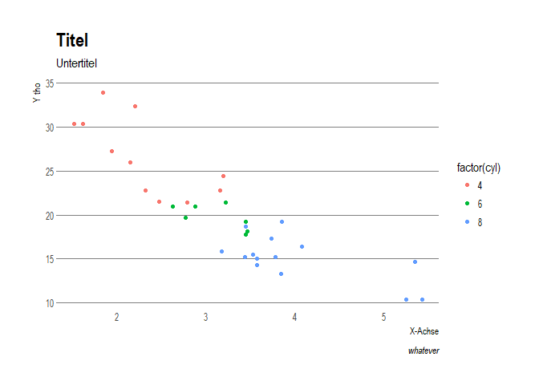

Fix fonts for hrbrthemes-ggplot-theme
================
Marcel Schliebs
2 Dezember 2017

Nachtrag: Schriftarten-Problem
==============================

Some of you (or all of you, to be more precise) had problems with exporting ggplot-graphs to pdf when the **hrbrthemes**-package was used. This is due to the fact that the package relies on the so called Roboto font type, which is not installed on many devices.

We thus have the following options:

Use another (more basic theme)
------------------------------

If you wanna go for the easy way, just use one of the many, many other existing themes.

``` r
library(ggplot2)
p <- ggplot(mtcars, aes(wt, mpg))
p + geom_point(aes(colour = factor(cyl)))
```


Therefore, we will need to install and load just one little additional package: **ggthemes**

``` r
#install.packages("ggthemes")
library(ggthemes)
```

We can now add one of the following basic, built-in and always-functioning themes: First, the so called **black-white**-Theme:

``` r
p + 
  geom_point(aes(colour = factor(cyl))) + 
  theme_bw()
```


Also, we could use a nice **economist-theme**

``` r
p + 
  geom_point(aes(colour = factor(cyl))) + 
   theme_economist()
```


Furthermore, your possibilities are unlimited: try out one of the following themes:

-   theme\_base: a theme resembling the default base graphics in R. See also theme\_par
-   theme\_calc: a theme based on LibreOffice Calc.
-   theme\_economist: a theme based on the plots in the The Economist magazine.
-   theme\_excel: a theme replicating the classic ugly gray charts in Excel
-   theme\_few: theme from Stephen Few’s “Practical Rules for Using Color in Charts”.
-   theme\_fivethirtyeight: a theme based on the plots at fivethirtyeight.com.
-   theme\_gdocs: a theme based on Google Docs.
-   theme\_hc: a theme based on Highcharts JS.
-   theme\_par: a theme that uses the current values of the base graphics parameters in par.
-   theme\_pander: a theme to use with the pander package.
-   theme\_solarized: a theme using the solarized color palette.
-   theme\_stata: themes based on Stata graph schemes.
-   theme\_tufte: a minimal ink theme based on Tufte’s The Visual Display of Quantitative Information.
-   theme\_wsj: a theme based on the plots in the The Wall Street Journal.

Option 2: Fix font-Problem and use hrbrthemes
---------------------------------------------

The problem was that most of you did not have the **Roboto**-Font installed on their Computers. You can do this by following steps:

### Windows

1.  Go into the subfolder **tutorials\_help/ggplot\_themes\_fonts/Roboto**. In there, select all font files.
2.  Enter **Schriftarten** into the windows search bar. You will be directed to the respective window.
3.  Drag all the fonts from the **Roboto**-folder into the **Schriftarten**-folder. They will be installed automatically.

### Mac

Since I don't have a mac to test this, I cannot guarantee a safe solution, but you should be able to install **Roboto** through the steps outlined \[here\] (<https://www.maceinsteiger.de/how-to/fonts-schriften-unter-mac-os-installieren/>)

### Final steps

Now, we have to sync the font types on your PC/Mac with R-Studio. Thus, do the following **only once**

``` r
install.packages("hrbrthemes")
install.packages("extrafont")

extrafont::font_import() #
```

After running `extrafont::font_import`, you will need to type **Y** and press enter.

Then, everytime you want to plot something, do the following:

``` r
#install.packages("hrbrthemes")
library(ggplot2)
library(hrbrthemes)
library(extrafont)
loadfonts(device="pdf")
```

We are now able to fully use the **hrbrthemes**-package. For more inspiration, go to \[here\] (<https://github.com/hrbrmstr/hrbrthemes>)

``` r
p <- 
  ggplot(mtcars, aes(wt, mpg))+
  geom_point(aes(colour = factor(cyl))) + 
  labs(x = "X-Achse",
       y = "Y tho",
       title = "Titel",
       subtitle = "Untertitel",
       caption = "whatever")+
  theme_ipsum(grid = "Y")
p
```



Finally, we can save the plot to our working directory:

``` r
ggsave(filename = "results/figures/hrbr_plot.pdf",
       plot = p,
       device = "pdf",
       width = 10,
       height = 6,
       dpi = 1000)
```
